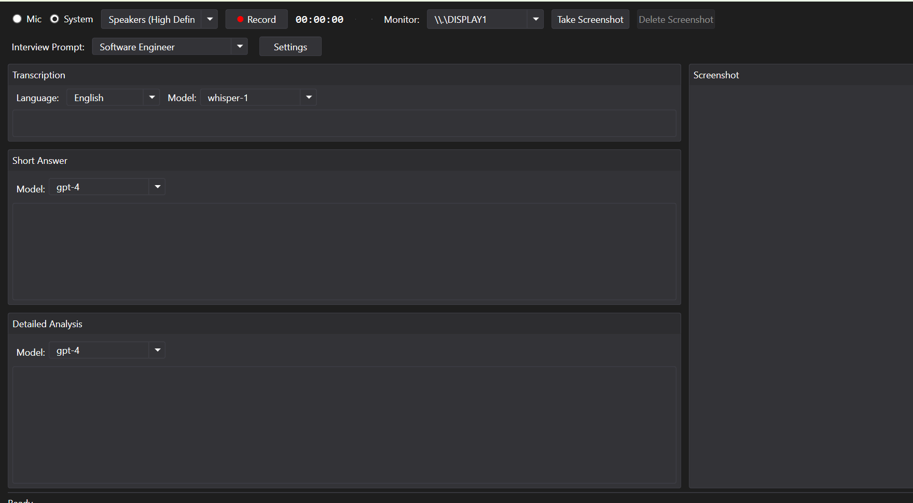

# Windows Interview Copilot

## Project Overview

Interview Copilot is a Windows desktop application built with .NET 9.0 that assists with interview preparation and management. The application is designed as a self-contained executable that runs on Windows systems without requiring additional installations.

## Key Features

- **Interview Preparation Tools**: Helps candidates prepare for technical interviews
- **Get current screenshots**: Capture screenshots of the current screen for reference
- **Multiple LLM models**: Possibility to get different responses from various language models using tailored prompts

## Usage

1. **Download the Executable**: Obtain the latest release from the [Releases]
2. **Ensure .NET 9.0 is Installed**: Make sure you have .NET 9.0 installed on your system. You can download it from the [official .NET website](https://dotnet.microsoft.com/download/dotnet/9.0).
3. **Unzip the Package**: Extract the contents of the downloaded zip file to a folder of your choice.
4. **Run the Application**: Double-click the executable file to launch the Interview Copilot.

## Technical Stack

- **Framework**: .NET 9.0 with WPF
- **Target Platform**: Windows x64

